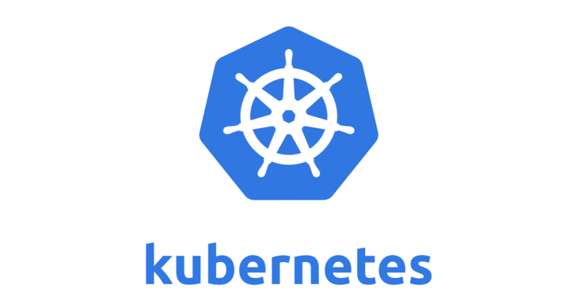

# django-kubernetes-monitor
 [](https://travis-ci.com/galbirk/django-kubernetes-monitor)<br>
Python Django web server to monitor digital ocean k8s clusters.<br>
## 
## Table of Contents
- [About](#About)
  * [Frontend - Django Webserver](#Frontend---Django-Webserver)
  * [Backend - Postgresql Database](#Backend---Postgresql-Database)
  * [Deployments options](#Deployments-options)
- [How to Deploy?](#How-to-Deploy?)
  * [Deploy With docker-compose](#Deploy-With-docker-compose)
    - [Install docker and docker-compose](#Install-docker-and-docker-compose)
    - [install docker and docker-compose on linux](#install-docker-and-docker-compose-on-linux)
    - [Clone git repository and deploy the compose file](#Clone-git-repository-and-deploy-the-compose-file)
    - [Environment Variables for django service](#Environment-Variables-for-django-service)
    - [Environment Variables for postgres service](#Environment-Variables-for-postgres-service)
   * [Deploy With Kubernetes](#Deploy-With-Kubernetes)
      - [Clone git repository](#Clone-git-repository)
      - [Deploy postgres](#Deploy-postgres)
      - [Deploy django](#Deploy-django)
      - [Environment Variables for django](#Environment-Variables-for-django)
      - [Environment Variables for postgres](#Environment-Variables-for-postgres)
      - [Kubernetes Resources](#Kubernetes-Resources)
        - [Django](#Django)
        - [Postgres](#Postgres)
- [How to use the app?](#How-to-use-the-app?)
  * [Users and Roles](#Users-and-Roles)
  * [Tags](#Tags)
- [Docker Hub Images](#Docker-Hub-Images)
- [Author Information](#Author-Information)
## About
### Frontend - Django Webserver
The web server contains user registartion and login logout system and a UI that montiors the k8s clusters from your Digital Ocean account.
### Backend - Postgresql Database
I used postgresql as my Database using "postgresql_psycopg2" django DB engine.
### Deployments options
The application can be deployed with either docker-compose or with kubernetes.
## How to Deploy?
### Deploy With docker-compose
In the docker-compose there is a pgadmin service for postgres managing and debugging postgersql.<br>
By default, the docker-compose uses the Dockerfile.test file for the django docker image.
#### Install docker and docker-compose
[docker installation documentation](https://docs.docker.com/get-docker/)<br>
[docker-compose installation documentation](https://docs.docker.com/compose/install/)<br>
##### install docker and docker-compose on linux
```bash
# Install docker
sudo curl -fsSL https://get.docker.com -o get-docker.sh
sudo sh get-docker.sh
sudo systemctl start docker && sudo systemctl enable docker
# Ensure installation succeed
sudo docker --version
# Install docker-compose
sudo curl -L "https://github.com/docker/compose/releases/download/1.27.4/docker-compose-$(uname -s)-$(uname -m)" -o /usr/local/bin/docker-compose
sudo chmod +x /usr/local/bin/docker-compose
sudo ln -s /usr/local/bin/docker-compose /usr/bin/docker-compose
# Ensure installation succeed
docker-compose --version
```
##### Clone git repository and deploy the compose file
```bash
git clone https://github.com/galbirk/django-kubernetes-monitor.git
cd django-kubernetes-monitor
docker-compose up # run docker-compose up -d for background running.
```
app url: http://[ip/hostname]:8000<br>
pgadmin url: http://[ip/hostname]:8080<br>
##### Environment Variables for django service
* **DJANGO_ALLOWED_HOSTS** --> django Allowed Hosts variable in [settings.py](app/monitor_k8s/settings.py)
* **DJANGO_DEBUG** --> django debug mode variable in [settings.py](app/monitor_k8s/settings.py)
* **DATABASE_ENGINE** --> django Database Engine variable in [settings.py](app/monitor_k8s/settings.py)
* **DJANGO_SECRET_KEY** --> django application secret key variable in [settings.py](app/monitor_k8s/settings.py)
* **DATABASE_NAME** --> django Database name variable in [settings.py](app/monitor_k8s/settings.py)
* **DATABASE_USERNAME** --> django Database username variable in [settings.py](app/monitor_k8s/settings.py)
* **DATABASE_PASSWORD** --> django Database password variable in [settings.py](app/monitor_k8s/settings.py)
* **DATABASE_HOST** --> django Database Engine variable in [settings.py](app/monitor_k8s/settings.py)
* **DJANGO_SUPERUSER_USERNAME** --> django superuser username 
* **DJANGO_SUPERUSER_PASSWORD** --> django superuser password
* **API_KEY** --> api key for [Digital Ocean API](https://developers.digitalocean.com/documentation/v2/)
##### Environment Variables for postgres service
The environment variables are in [.env](db/.env)
* **POSTGRES_DB** --> postgres Database name
* **POSTGRES_USER** --> postgres username
* **POSTGRES_PASSWORD** --> postgres user password
### Deploy With Kubernetes
Create k8s cluster on-perm or on any cloud provider.
#### Clone git repository
```bash
git clone https://github.com/galbirk/django-kubernetes-monitor.git
cd django-kubernetes-monitor/kubernetes
```
#### Deploy postgres
```bash
cd django-kubernetes-monitor/kubernetes
kubectl apply -f postgres/
```
**NOTICE: If you want to deploy just part of the resources (deploy without persistent volume) you can access the postgres/ directory and apply each file seperatly with kubectl apply -f filename** 
#### Deploy django
```bash
cd django-kubernetes-monitor/kubernetes/django

# Create django-secrets
kubectl create secret generic django-secrets --from-env-file=django-secrets
cd ..
kubectl apply -f django/

# Get Load Balancer IP
kubectl get svc | grep django-svc | awk '{print $4}'
```
app url: http://[lb-ip/hostname]<br>
**NOTICE: Before you are deploying the app in k8s, you need to configure your app with the environmet variables below!**
#### Environment Variables for django
The environment varibles are in [django-configmap.yaml](kubernetes/django/django-configmap.yaml) and in [django-secrets](kubernetes/django/django-secrets)
* **DJANGO_ALLOWED_HOSTS** --> django Allowed Hosts variable in [settings.py](app/monitor_k8s/settings.py)
* **DJANGO_DEBUG** --> django debug mode variable in [settings.py](app/monitor_k8s/settings.py)
* **DATABASE_ENGINE** --> django Database Engine variable in [settings.py](app/monitor_k8s/settings.py)
* **DJANGO_SECRET_KEY** --> django application secret key variable in [settings.py](app/monitor_k8s/settings.py)
* **DATABASE_NAME** --> django Database name variable in [settings.py](app/monitor_k8s/settings.py)
* **DATABASE_USERNAME** --> django Database username variable in [settings.py](app/monitor_k8s/settings.py)
* **DATABASE_PASSWORD** --> django Database password variable in [settings.py](app/monitor_k8s/settings.py)
* **DATABASE_HOST** --> django Database Engine variable in [settings.py](app/monitor_k8s/settings.py)
* **DJANGO_SUPERUSER_USERNAME** --> django superuser username 
* **DJANGO_SUPERUSER_PASSWORD** --> django superuser password
* **API_KEY** --> api key for [Digital Ocean API](https://developers.digitalocean.com/documentation/v2/)
#### Environment Variables for postgres
The environment variables are in [postgres-configmap.yaml](kubernetes/postgres/postgres-configmap.yaml)
* **POSTGRES_DB** --> postgres Database name
* **POSTGRES_USER** --> postgres username
* **POSTGRES_PASSWORD** --> postgres user password
#### Kubernetes Resources
##### Django
* **django-configmap.yaml** --> configmap for django environment variables
* **django-job.yaml** --> job to migrate django models to database
* **django-secrets** --> secrets for django environment variables
* **django-deployment.yaml** --> deployment for django
* **django-service.yml** --> service for django (LB service for cloud cluster, you can uncomment the ClusterIP service and add ingress to it )
##### Postgres 
* **postgres-configmap.yaml** --> configmap for postgres environment variables
* **postgres-deployment.yaml** --> deployment for postgres
* **postgres-service.yaml** --> ClusterIP service for postgres
## How to use the app?
### Users and Roles
The app has registeration and login/logout systems, there are **3 roles**:
* **superuser** --> the admins of the website, can reach to the administartion page with , http://[ip/hostname]:8000/admin. They can see all the clusters.
* **partner** --> they can see all the clusters that tagged with partner:<username> tag.
* **client** --> they can see all the clusters that tagged with client:<username> tag.
  
### Tags
To let the app monitor your clusters, for many users with different roles you will have to tag the clusters.<br>
**client role tag:**<br>
client:<client_username><br>
**partnet role tag:**<br>
partner:<partner_username>
## Docker Hub Images
### The images are published in Docker Hub:
* [django image](https://hub.docker.com/repository/docker/galbirk/django-k8s-monitor)
* [postgres image](https://hub.docker.com/repository/docker/galbirk/django-k8s-monitor-postgres)

## Author Information

<b>Gal Birkman, DevOps Engineer.</b><br>
<b>email:</b> galbirkman@gmail.com<br>
<b>GitHub:</b> https://github.com/galbirk
